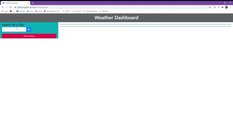

# Weather-Dashboard
This weather application allows the user to search for a city and find it's current weather and subsequent five-day forecast. The cities searched will be kept in the history list on the left side of the screen, which may be cleared by using the "Clear History" button. Upon clicking on one of the history options, the page will be updated to show the weather for that specific city. 

### Demo:

